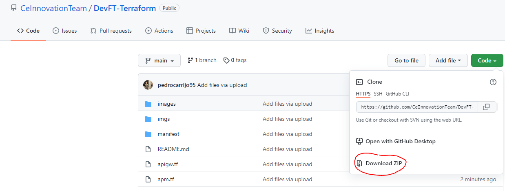
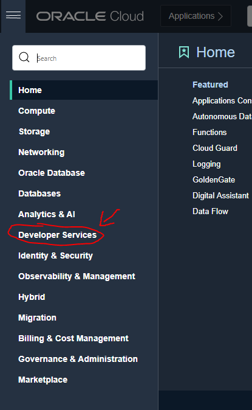
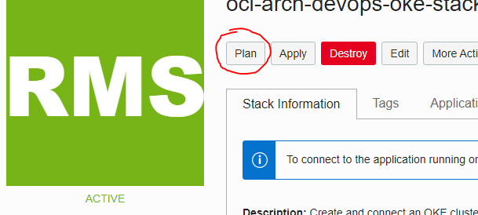
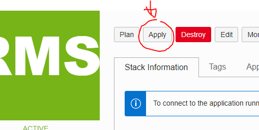

# Utilizando terraform no OCI

  

**Objetivo desse LAB:**

Provisionar recursos dentro do OCI utilizando infraestrutura como código.

  

**Os recursos provisionados serão:**

  

1. OKE

2. DEVOPS

3. APM

4. API GATEWAY

**Juntamente com recursos de REDE e GERENCIAMENTO como:**

1. VCN

2. SUBNETS

3. DYNAMIC GROUPS

4. COMPARTMENTS

  

## 1. Download repositório

  

 - Como primeiro passo devemos fazer o download desse repositório do
   github e para isso existem 2 opções:

  

  **1. git clone https://github.com/CeInnovationTeam/DevFT-Terraform.git**

    

  OU

    

  **2. download do .zip direto no github**

  



  

 - Ok, agora já possuímos uma pasta com os códigos terraform prontos
   para utilizarmos vamos então **codificar um arquivo .tf** para
   provisionarmos um **Oracle API Gateway** juntamente com os outros
   recursos já criados nessa pasta.

  

## 2. Criar um novo arquivo .tf

  

 - Para criarmos um novo arquivo terraform simplesmente adicionamos um
   novo arquivo de texto com o nome **"apigateway.tf"** ou então
   qualquer outro nome mas com a extensão **".tf"** DENTRO DA PASTA que estão os outros arquivos terraform.

  

Exemplo:

  


  

 - Agora adicionamos esse código abaixo para dizer que queremos
   provisionar um Oracle API Gateway:

```

resource "oci_apigateway_gateway" "devops_gateway" {

	compartment_id = var.compartment_id
	endpoint_type = var.api_gateway_type
	subnet_id = oci_core_subnet.oke_lb_subnet[0].id
	display_name = var.api_gateway_name

}

```

Neste código estamos dizendo que queremos criar um novo recurso do tipo **"oci_apigateway_gateway"** e estamos setando as infos necessárias para configurar este recurso.

  

Fonte deste código: [Documentação Terraform sobre API GATEWAY](https://registry.terraform.io/providers/hashicorp/oci/latest/docs/resources/apigateway_gateway)

  

 - **Criado e preenchido este arquivo .tf, podemos agora fazer o upload de toda essa infra como código no OCI**

  

## Upload do terraform no Oracle Resource Manager

  

- Primeiro de tudo devemos estar **logados no OCI**

- Vá até o menu sanduiche na esquerda

  


- Clique em "**Developer Services**"

  




- Nas opcões que aparecer selecione "**Resource Manager**".

  


- Selecione e crie uma nova **STACK**

  


- Selecione como source **a pasta do seu computador contendo os arquivos .tf baixados**, fazendo assim com que o Resource Manager já preencha todos os campos.

  


- Clique em NEXT e podemos conferir as infos sobre os recursos que serão provisionados.

- Selecione um compartment como primeira opção e o restante não será necessário alterar.

- Clique em NEXT.

  


- Nessa nova tela irá pedir para conferir as informações e clique em CREATE

  


- Criado nossa STACK vamos agora clicar em PLAN

  



  


- Após concluído nosso PLAN, vamos agora voltar para nossa STACK e clicar em APPLY para de fato iniciar os provisionamentos e isso irá durar em torno de uns 20 minutos.

  



  


  

## Ambientes Provisionados com Sucesso !

  

 - Após finalizar o APPLY com sucesso, podemos conferir nossos
   provisionamentos que foram efetuados.

  

**Recursos provisionados:**

  

1. OKE

2. DEVOPS

3. APM

4. API GATEWAY

**Juntamente com recursos de REDE e GERENCIAMENTO como:**

1. VCN

2. SUBNETS

3. DYNAMIC GROUPS

4. COMPARTMENTS
